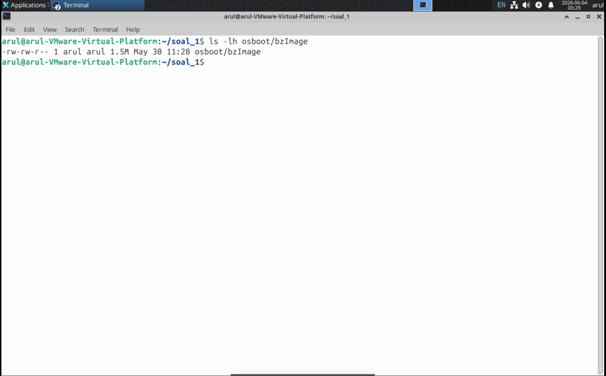
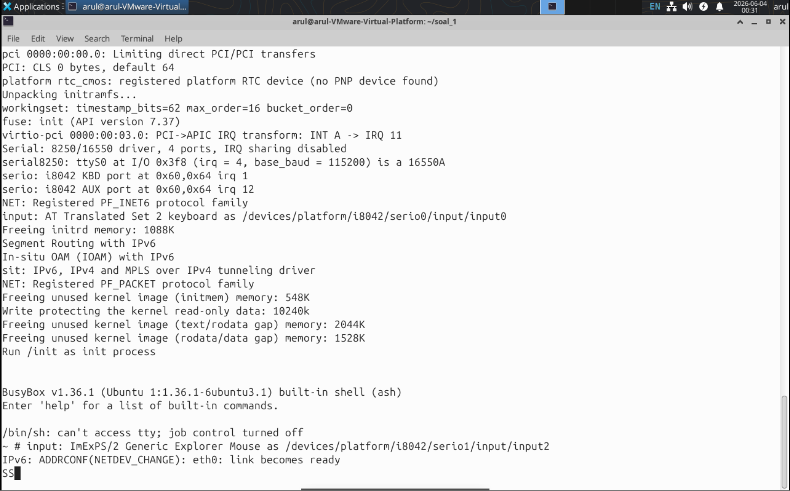
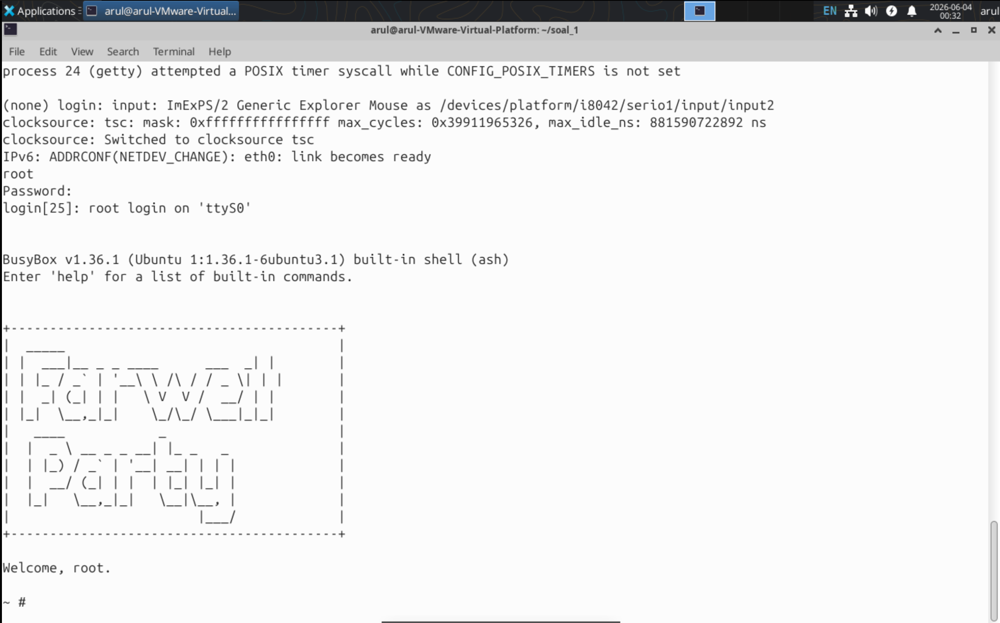
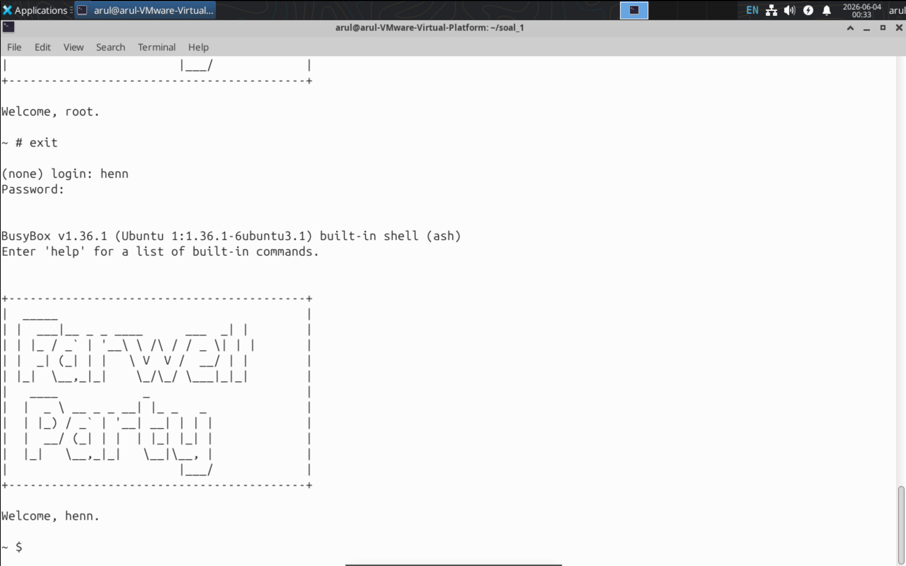
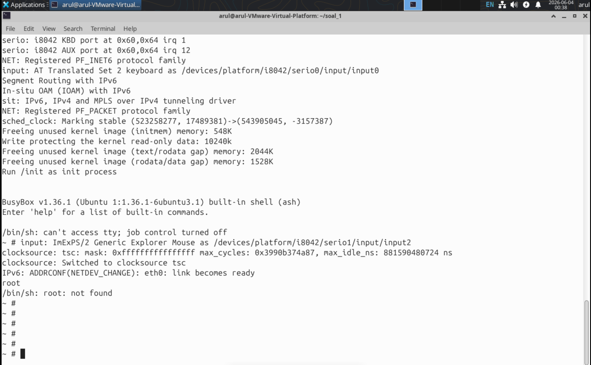
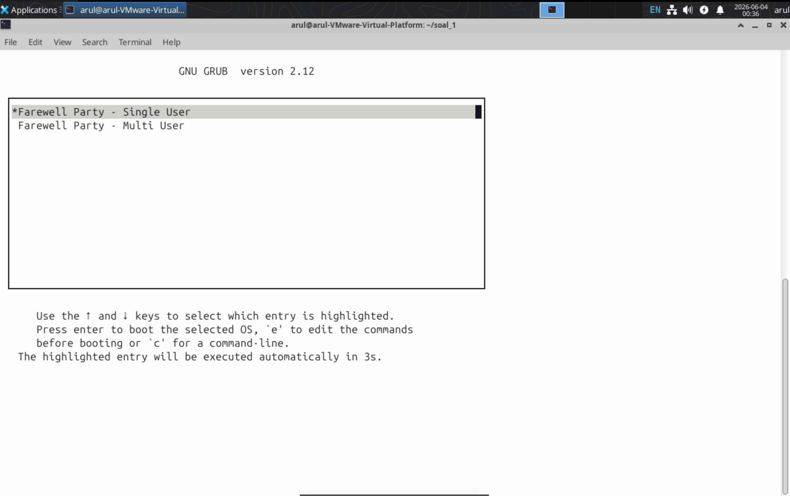
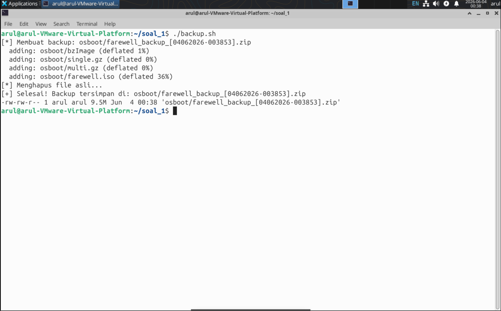
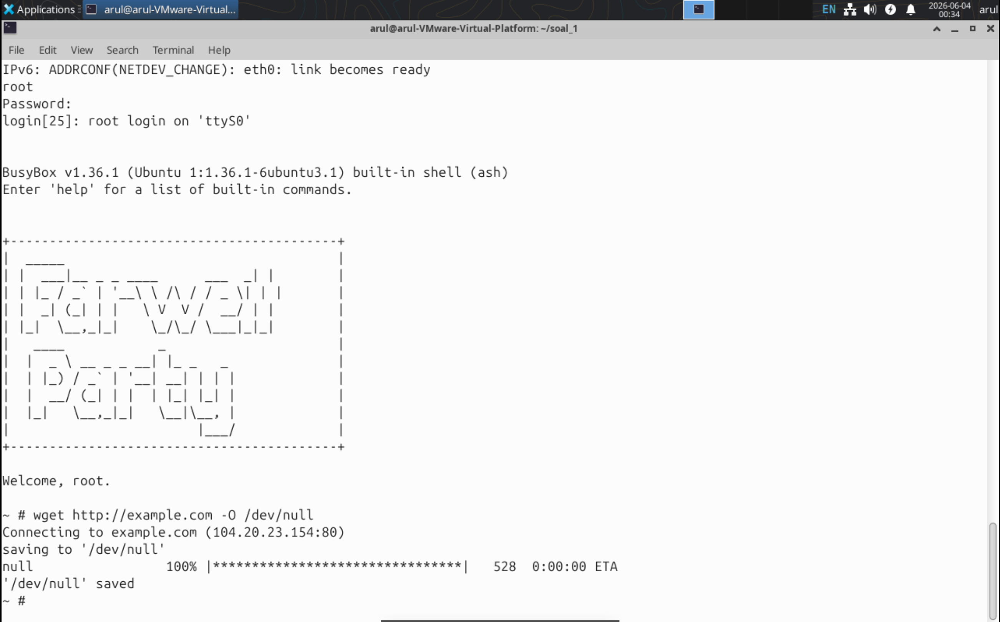
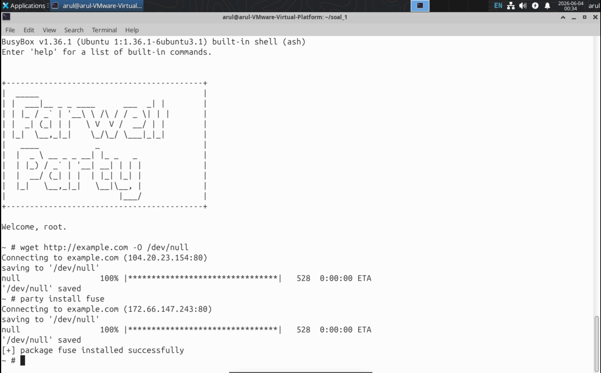
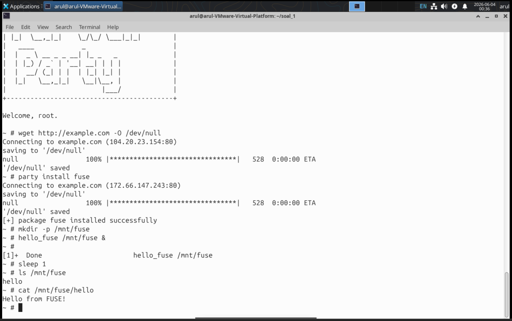

# Laporan Praktikum SISOP Modul 5 — Farewell Party

| Nama | NRP |
|------|-----|
| Muhamad Nasrulhaq | 5027251117 |

---

## Daftar Isi

- [Soal 2 — kernel.sh](#soal-2--kernelsh)
- [Soal 3 — single.sh](#soal-3--singlesh)
- [Soal 4 — multi.sh](#soal-4--multish)
- [Soal 5 — iso.sh](#soal-5--isosh)
- [Soal 6 — qemu.sh](#soal-6--qemush)
- [Soal 7 — backup.sh](#soal-7--backupsh)
- [Soal 8 — Internet Access](#soal-8--internet-access)
- [Soal 9 — Package Manager party](#soal-9--package-manager-party)
- [Soal 10 — Program FUSE](#soal-10--program-fuse)

---

## Soal 2 — kernel.sh

### Penjelasan Poin Soal

> Karena mau ngeboot kernel linux berarti butuh linux nya dulu dong, nah coba lengkapin deh script **kernel.sh**, script ini kalo dijalankan nanti bakalan coba untuk download linux kernel **6.1.1**, dan nanti outputnya bakal ada di **osboot/bzImage**

→ Script `kernel.sh` bertugas mengunduh source code Linux kernel versi 6.1.1, mengkonfigurasi, mengompilasi, lalu menyalin hasil kompilasi ke `osboot/bzImage`.

---

### Edge Case & Error Handling

1. **File tarball sudah ada** — Script mengecek apakah `linux-6.1.1.tar.xz` sudah ada sebelum mengunduh ulang, sehingga tidak membuang bandwidth jika sudah pernah diunduh.

2. **Direktori source sudah ada** — Script mengecek apakah folder `linux-6.1.1/` sudah ada sebelum mengekstrak, menghindari ekstraksi ulang yang memakan waktu.

3. **File `.config` sudah ada** — Jika `.config` sudah ada di folder soal, script menggunakannya langsung dengan `make olddefconfig` tanpa membuat konfigurasi dari awal.

4. **Konfigurasi dari nol** — Jika `.config` belum ada, script memulai dari `make tinyconfig` (konfigurasi minimal) lalu mengaktifkan fitur yang dibutuhkan satu per satu via `scripts/config --enable`, kemudian menyimpan hasilnya ke `.config` untuk digunakan kembali.

---

### Penjelasan Kode

> Script ini kalo dijalankan nanti bakalan coba untuk download linux kernel **6.1.1**

→ Download kernel dari CDN resmi kernel.org dengan pengecekan apakah sudah ada.

```bash
# kernel.sh
if [ ! -f "${KERNEL_DIR}.tar.xz" ]; then
    echo "[*] Mengunduh kernel ${KERNEL_VERSION}..."
    wget "https://cdn.kernel.org/pub/linux/kernel/v6.x/${KERNEL_DIR}.tar.xz"
else
    echo "[*] File kernel sudah ada, skip download."
fi
```

> Script mengecek file sebelum download ulang untuk menghemat waktu.

---

> Konfigurasi kernel menggunakan `tinyconfig` sebagai basis minimal.

→ Dimulai dari konfigurasi terkecil, lalu fitur-fitur penting diaktifkan secara eksplisit.

```bash
# kernel.sh
make tinyconfig

scripts/config --enable CONFIG_TTY
scripts/config --enable CONFIG_SERIAL_8250_CONSOLE
scripts/config --enable CONFIG_VIRTIO_MENU
scripts/config --enable CONFIG_VIRTIO_PCI
scripts/config --enable CONFIG_VIRTIO_NET
scripts/config --enable CONFIG_FUSE_FS
scripts/config --enable CONFIG_MULTIUSER
scripts/config --enable CONFIG_PCI
scripts/config --enable CONFIG_NETDEVICES

make olddefconfig
```

> `CONFIG_MULTIUSER` diperlukan agar syscall `setgroups` tersedia untuk login multi-user. `CONFIG_VIRTIO_MENU` diperlukan agar `CONFIG_VIRTIO_PCI` bisa aktif.

---

> Output disalin ke `osboot/bzImage`.

```bash
# kernel.sh
mkdir -p ../osboot
cp arch/x86/boot/bzImage ../osboot/bzImage
```

> Folder `osboot/` dibuat otomatis jika belum ada.

---

### Dokumentasi Screenshot



*Screenshot terminal menampilkan pesan `Kernel: arch/x86/boot/bzImage is ready` dan output `ls -lh osboot/bzImage`.*

```bash
./kernel.sh
ls -lh osboot/bzImage
```

---

## Soal 3 — single.sh

### Penjelasan Poin Soal

> Habis compile kernel selanjutnya adalah bikin filesystemnya. Oke pertama yang perlu dibikin adalah buat **single filesystem** dulu, jadi lengkapi script **single.sh** buat bikin filesystemnya, oh iyaa jangan lupa pakai BusyBox buat nge-scaffold shell environmentnya yaa. Hasil build terakhir nanti masuk ke **osboot/single.gz**
>
> - User : **root** (hanya root)
> - Directory : bin/, dev/, proc/, sys/, /etc, tmp/, root/
> - Access : **root** bisa akses apapun

→ Script `single.sh` membuat initramfs minimal dengan satu user (root), langsung masuk shell tanpa proses login.

---

### Edge Case & Error Handling

1. **Script dijalankan bukan sebagai root** — Script mengecek `id -u` dan keluar dengan pesan error jika bukan root, karena `chown` dan `mknod` membutuhkan hak root.

2. **Folder kerja sementara** — Folder `single_fs/` selalu dihapus dan dibuat ulang di awal untuk memastikan hasil selalu bersih.

3. **Device tty gagal di-copy** — Perintah `cp -a /dev/tty*` menggunakan `2>/dev/null || true` agar tidak menyebabkan script gagal jika ada device yang tidak bisa disalin.

4. **Folder osboot belum ada** — Script membuat `osboot/` secara otomatis sebelum menulis output.

---

### Penjelasan Kode

> User : **root** (hanya root), Access : **root** bisa akses apapun

→ `/etc/passwd` hanya berisi root tanpa password, dan direktori `root/` diberi permission 700.

```bash
# single.sh
cat > "$WORK_DIR/etc/passwd" << 'EOF'
root::0:0:root:/root:/bin/sh
EOF

chmod 700  "$WORK_DIR/root"
chmod 1777 "$WORK_DIR/tmp"
```

> Password kosong (field ke-2 kosong) membuat root langsung masuk shell tanpa autentikasi. Sticky bit pada `/tmp` memastikan semua user bisa menulis tapi tidak bisa menghapus file milik orang lain.

---

> Jangan lupa pakai BusyBox buat nge-scaffold shell environmentnya.

→ BusyBox di-install dengan symlink ke semua perintah yang didukung.

```bash
# single.sh
cp /usr/bin/busybox "$WORK_DIR/bin/"
cd "$WORK_DIR/bin"
./busybox --install .
cd - > /dev/null
```

> `./busybox --install .` membuat symlink (ls, sh, mount, dll) di direktori `bin/`.

---

> Init script langsung masuk shell tanpa login.

```bash
# single.sh - init
#!/bin/sh
/bin/mount -t proc  none /proc
/bin/mount -t sysfs none /sys
exec /bin/sh
```

> `exec /bin/sh` menggantikan proses init dengan shell langsung (PID 1 menjadi shell).

---

> Hasil build masuk ke **osboot/single.gz**.

```bash
# single.sh
cd "$WORK_DIR"
find . | cpio -oHnewc | gzip > "../$OUTPUT"
cd ..
rm -rf "$WORK_DIR"
```

> `cpio -oHnewc` mengemas file dalam format newc yang dipahami kernel Linux. Folder sementara dihapus setelah dikemas.

---

### Dokumentasi Screenshot



*Screenshot QEMU menampilkan shell `~ #` langsung tanpa prompt login.*

```bash
./qemu.sh --single
```

---

## Soal 4 — multi.sh

### Penjelasan Poin Soal

> Bisa lengkapi file **multi.sh** buat bikin multi filesystemnya, jangan lupa juga tetap pakai BusyBox buat nge-scaffold environment shellnya. Nanti output hasil buildnya ada di **osboot/multi.gz**
>
> - User : root, henn, hann, viii, kids
> - Directory : bin/, dev/, proc/, sys/, etc/, tmp/, root/, home/{henn,hann,viii,kids}
> - Password : (sesuai tabel)
> - Access : (sesuai tabel per user)
> - Banner : Pas pertama kali user login harus ada ascii art **Farewell Party** dan dibawahnya harus ada **Welcome, \<USER\>.**

→ Script `multi.sh` membuat initramfs dengan 5 user, sistem login via `getty`, permission direktori berbasis group membership, dan banner ASCII art yang muncul saat pertama kali login.

---

### Edge Case & Error Handling

1. **Script dijalankan bukan sebagai root** — Dicek dengan `id -u`, keluar dengan pesan error jika bukan root.

2. **Password di-hash saat runtime** — Password di-hash dengan `openssl passwd -1` saat script dijalankan, bukan di-hardcode sebagai plaintext di file.

3. **Banner hanya muncul sekali** — Flag file di `/tmp/.banner_shown_<uid>` memastikan banner hanya muncul saat pertama kali login, tidak setiap kali buka shell.

4. **Akses direktori berbasis group** — Implementasi access control menggunakan Unix group membership, bukan ACL, agar kompatibel dengan BusyBox.

5. **Device `/dev/fuse` dibuat manual** — `/dev/fuse` tidak bisa di-copy dari host, sehingga dibuat dengan `mknod` agar program FUSE bisa berjalan.

---

### Penjelasan Kode

> Password sesuai tabel user.

→ Hash dibuat saat script dijalankan menggunakan `openssl passwd -1`.

```bash
# multi.sh
HASH_ROOT=$(openssl passwd -1 root123)
HASH_HENN=$(openssl passwd -1 henn123)
HASH_HANN=$(openssl passwd -1 hann123)
HASH_VIII=$(openssl passwd -1 viii123)
HASH_KIDS=$(openssl passwd -1 kids123)

cat > "$WORK_DIR/etc/passwd" << EOF
root:${HASH_ROOT}:0:0:root:/root:/bin/sh
henn:${HASH_HENN}:1000:1000::/home/henn:/bin/sh
hann:${HASH_HANN}:1001:1001::/home/hann:/bin/sh
viii:${HASH_VIII}:1002:1002::/home/viii:/bin/sh
kids:${HASH_KIDS}:1003:1003::/home/kids:/bin/sh
EOF
```

> Format hash `$1$...` (MD5 crypt) didukung oleh BusyBox `login`.

---

> Access : henn full /home/\*, hann full /home/{hann,viii,kids}, dst.

→ Implementasi menggunakan group membership. Setiap home directory dimiliki oleh group yang mencakup user yang boleh mengaksesnya.

```bash
# multi.sh
cat > "$WORK_DIR/etc/group" << 'EOF'
root:x:0:root
henn:x:1000:henn
hann:x:1001:hann,henn
viii:x:1002:viii,henn,hann
kids:x:1003:kids,henn,hann,viii
EOF

chown -R 1000:1000 "$WORK_DIR/home/henn"
chmod 770           "$WORK_DIR/home/henn"

chown -R 1001:1001 "$WORK_DIR/home/hann"
chmod 770           "$WORK_DIR/home/hann"

chown -R 1002:1002 "$WORK_DIR/home/viii"
chmod 770           "$WORK_DIR/home/viii"

chown -R 1003:1003 "$WORK_DIR/home/kids"
chmod 770           "$WORK_DIR/home/kids"

chmod 700 "$WORK_DIR/root"
chmod 1777 "$WORK_DIR/tmp"
```

> Mode 770 berarti owner dan group mendapat full access, others tidak bisa akses sama sekali. Dengan group kids berisi semua user, `/home/kids` bisa diakses semua user.

---

> Banner : ascii art **Farewell Party** + **Welcome, \<USER\>.**

→ Banner disimpan di `/etc/farewell_banner` dan ditampilkan via `/etc/profile` dengan pengecekan flag.

```bash
# multi.sh - /etc/profile
FLAG="/tmp/.banner_shown_$(id -u)"
if [ ! -f "$FLAG" ]; then
    touch "$FLAG"
    cat /etc/farewell_banner
    echo "Welcome, $(whoami)."
    echo ""
fi
```

> `id -u` menghasilkan UID user yang login, sehingga flag unik per user. `/etc/profile` di-source oleh BusyBox `login` setelah autentikasi berhasil.

---

> Init menggunakan `getty` untuk prompt login.

```bash
# multi.sh - init
#!/bin/sh
/bin/mount -t proc  none /proc
/bin/mount -t sysfs none /sys

ip link set eth0 up
ip addr add 10.0.2.15/24 dev eth0
ip route add default via 10.0.2.2
echo "nameserver 10.0.2.3" > /etc/resolv.conf

while true; do
    /bin/getty -L ttyS0 115200 vt100
    sleep 1
done
```

> `getty` menampilkan prompt login dan memanggil `login` untuk autentikasi. Loop `while true` memastikan prompt login muncul kembali setelah user logout.

---

### Dokumentasi Screenshot



*Screenshot QEMU menampilkan prompt `(none) login:` dan setelah login berhasil menampilkan banner ASCII art Farewell Party serta `Welcome, root.`*

```bash
./qemu.sh --multi
# login: root
# password: root123
```



*Screenshot login sebagai `henn` menampilkan banner dan `Welcome, henn.`*

```bash
# login: henn
# password: henn123
```

---

## Soal 5 — iso.sh

### Penjelasan Poin Soal

> Compile kernel udah, single filesystem udah, multi filesystem juga udah, apa lagi yaa? Oh, iya selanjutnya adalah bikin ISO bootable nya. Lengkapi script **iso.sh**, dimana tujuan dari script ini buat bikin bootable, bootable ini harus bisa melakukan *load* kedua filesystem sebelumnya tadi yaitu **single** dan **multi** filesystem user. Outputnya nanti masuk ke **osboot/farewell.iso**

→ Script `iso.sh` membuat file ISO bootable menggunakan GRUB dengan dua menu entry: single-user dan multi-user filesystem.

---

### Edge Case & Error Handling

1. **Validasi file prerequisite** — Script mengecek keberadaan `bzImage`, `single.gz`, dan `multi.gz` sebelum mulai, dan keluar dengan pesan error jika ada yang belum ada.

2. **Folder build selalu bersih** — Folder `iso_build/` dihapus dan dibuat ulang di awal untuk menghindari sisa build sebelumnya.

3. **Cleanup setelah build** — Folder `iso_build/` dihapus setelah ISO berhasil dibuat.

---

### Penjelasan Kode

> Bootable ini harus bisa melakukan load kedua filesystem.

→ GRUB config memiliki dua menu entry yang masing-masing memuat filesystem berbeda.

```bash
# iso.sh - grub.cfg
set timeout=10
set default=0

menuentry "Farewell Party - Single User" {
    linux  /boot/bzImage console=ttyS0 quiet
    initrd /boot/single.gz
}

menuentry "Farewell Party - Multi User" {
    linux  /boot/bzImage console=ttyS0 quiet
    initrd /boot/multi.gz
}
```

> `set timeout=10` memberi waktu 10 detik untuk memilih sebelum boot otomatis ke pilihan pertama.

---

> Output masuk ke **osboot/farewell.iso**.

```bash
# iso.sh
grub-mkrescue -o "$OUTPUT" "$ISO_DIR" 2>/dev/null
```

> `grub-mkrescue` mengemas folder ISO build beserta GRUB bootloader menjadi satu file ISO yang bootable.

---

### Dokumentasi Screenshot


*Screenshot GRUB menu menampilkan dua pilihan: "Farewell Party - Single User" dan "Farewell Party - Multi User".*

```bash
./qemu.sh --all
```

---

## Soal 6 — qemu.sh

### Penjelasan Poin Soal

> Oke brarti bisa lengkapi script **qemu.sh** buat *ngeboot* OS yang udah coba kalian bikin tadi, oh yaa tapi ada specs nya, kayak gini:
>
> - `./qemu.sh --single` : Boot single-user filesystem langsung
> - `./qemu.sh --multi` : Boot multi-user filesystem langsung
> - `./qemu.sh --all` : Boot dari ISO, terus nanti bisa milih mau boot ke single atau multi

→ Script `qemu.sh` menerima flag argumen untuk menentukan mode boot QEMU.

---

### Edge Case & Error Handling

1. **File tidak ditemukan** — Setiap mode mengecek keberadaan file yang dibutuhkan sebelum menjalankan QEMU dan keluar dengan pesan error yang informatif.

2. **Argumen tidak valid** — Jika argumen selain `--single`, `--multi`, atau `--all` diberikan, script menampilkan usage dan keluar.

3. **Network user-mode** — Menggunakan `-netdev user` agar tidak membutuhkan hak root untuk menjalankan QEMU dengan networking.

---

### Penjelasan Kode

> `./qemu.sh --single` Boot single-user filesystem langsung.

```bash
# qemu.sh
--single)
    qemu-system-x86_64 \
        -smp 2 \
        -m 256 \
        -kernel "$KERNEL" \
        -initrd "$SINGLE" \
        -append "console=ttyS0 rdinit=/init" \
        $NET_OPTS \
        -nographic
    ;;
```

> `-nographic` mengarahkan output ke terminal. `console=ttyS0` memberitahu kernel untuk menggunakan serial port sebagai console.

---

> `./qemu.sh --all` Boot dari ISO.

```bash
# qemu.sh
--all)
    qemu-system-x86_64 \
        -smp 2 \
        -m 256 \
        -cdrom "$ISO" \
        -boot d \
        $NET_OPTS \
        -nographic
    ;;
```

> `-boot d` berarti boot dari CD-ROM. GRUB akan otomatis tampil dan user bisa memilih filesystem.

---

### Dokumentasi Screenshot



*Screenshot boot `--single` langsung masuk shell.*

```bash
./qemu.sh --single
```



*Screenshot boot `--all` menampilkan GRUB menu.*

```bash
./qemu.sh --all
```

---

## Soal 7 — backup.sh

### Penjelasan Poin Soal

> Terakhir untuk keperluan arsip maka semua file tadi lebih baik dibackup aja, karena pasti isinya banyak dan besar - besar hasilnya. Nah maka dari itu coba lengkapi script **backup.sh**, script ini bakal nge zip semua file **bzImage, single.gz, multi.gz, farewell.iso**, terus nanti tinggal simpen hasilnya di **osboot/**, terus file - file yang diarsip tersebut bisa dihapus aja.
>
> Format: `farewell_backup_[DDMMYYYY-HHMMSS].zip`

→ Script `backup.sh` mengemas empat file output ke dalam satu ZIP dengan nama berformat timestamp, lalu menghapus file aslinya.

---

### Edge Case & Error Handling

1. **Validasi semua file ada** — Script mengecek keempat file (`bzImage`, `single.gz`, `multi.gz`, `farewell.iso`) satu per satu sebelum memulai backup. Jika ada yang kurang, script keluar dengan pesan error.

2. **Format timestamp otomatis** — Nama file backup di-generate otomatis dengan `date` sesuai format yang diminta soal.

---

### Penjelasan Kode

> Format: `farewell_backup_[DDMMYYYY-HHMMSS].zip`

```bash
# backup.sh
TIMESTAMP=$(date +"%d%m%Y-%H%M%S")
OUTPUT="osboot/farewell_backup_[${TIMESTAMP}].zip"
```

> `date +"%d%m%Y-%H%M%S"` menghasilkan timestamp dengan format hari-bulan-tahun-jam-menit-detik.

---

> File yang diarsip tersebut bisa dihapus.

```bash
# backup.sh
zip "$OUTPUT" \
    osboot/bzImage \
    osboot/single.gz \
    osboot/multi.gz \
    osboot/farewell.iso

rm -f osboot/bzImage osboot/single.gz osboot/multi.gz osboot/farewell.iso
```

> File dihapus setelah berhasil di-zip sesuai instruksi soal.

---

### Dokumentasi Screenshot



*Screenshot terminal menampilkan proses zip dan nama file `farewell_backup_[DDMMYYYY-HHMMSS].zip` beserta ukurannya.*

```bash
./backup.sh
ls -lh osboot/*.zip
```

---

## Soal 8 — Internet Access

### Penjelasan Poin Soal

> Dari semua proses diatas sebenarnya kalian harusnya udah bisa booting OS kalian sendiri, cuman disini ada beberapa hal yang harus dilakukan lagi, untuk bisa benar - benar memastikan bahwa os kalian itu ngga cuman hanya bisa diboot aja. Pastiin bahwa OS kalian ini bisa **akses internet**. Lakukan test berikut:
>
> `ping 8.8.8.8`
>
> `wget example.com`

→ OS harus bisa mengakses internet dari dalam QEMU. Implementasi menggunakan QEMU user-mode networking dengan konfigurasi IP statis di `init` script.

---

### Edge Case & Error Handling

1. **ICMP ping tidak work** — QEMU user-mode networking (slirp) tidak mendukung ICMP secara penuh, sehingga `ping 8.8.8.8` menunjukkan 100% packet loss. Namun koneksi TCP (wget) tetap berfungsi normal.

2. **udhcpc tidak mengkonfigurasi interface** — BusyBox `udhcpc` membutuhkan script `/usr/share/udhcpc/default.script` untuk mengaplikasikan IP ke interface. Karena script tersebut tidak ada, konfigurasi dilakukan secara manual dengan `ip addr add`.

3. **DNS tidak dikonfigurasi** — QEMU menyediakan DNS di `10.0.2.3`, perlu ditambahkan manual ke `/etc/resolv.conf`.

---

### Penjelasan Kode

> OS harus bisa akses internet.

→ Konfigurasi network dilakukan di `init` script dalam `multi.sh` agar otomatis saat boot.

```bash
# multi.sh - bagian init
ip link set eth0 up
ip addr add 10.0.2.15/24 dev eth0
ip route add default via 10.0.2.2
echo "nameserver 10.0.2.3" > /etc/resolv.conf
```

> QEMU user-mode networking menyediakan gateway di `10.0.2.2` dan DNS di `10.0.2.3`. IP `10.0.2.15` adalah IP default yang diberikan QEMU ke guest.

---

> QEMU menggunakan virtio-net untuk networking.

```bash
# qemu.sh
NET_OPTS="-netdev user,id=net0 -device virtio-net-pci,netdev=net0"
```

> `-netdev user` menggunakan user-mode networking (slirp) yang tidak membutuhkan hak root dan otomatis melakukan NAT ke jaringan host.

---

### Dokumentasi Screenshot



*Screenshot terminal di dalam QEMU menampilkan `wget http://example.com` berhasil dengan status 100%.*

```bash
./qemu.sh --multi
# setelah login:
wget http://example.com -O /dev/null
```

---

## Soal 9 — Package Manager party

### Penjelasan Poin Soal

> Setelah kalian bisa melakukan akses internet, OS kalian juga harus punya package manager sendiri. Pastikan package manager kalian bisa install sebuah package. Nah, kalian gaperlu bikin package manager sendiri, bisa pake turunan package manager dari distro linux yang sudah ada, tapi nanti binary package manager kalian harus dinamai dengan **party**

→ Binary `party` dibuat sebagai shell script wrapper yang menggunakan `wget` untuk simulasi instalasi package.

---

### Edge Case & Error Handling

1. **Argumen tidak valid** — Jika argumen selain `install` diberikan, script menampilkan pesan usage.

2. **Koneksi gagal** — Jika `wget` gagal, script menampilkan pesan `[-] failed to install <package>`.

---

### Penjelasan Kode

> Binary package manager harus dinamai dengan **party**.

→ Script `party` disimpan di `/bin/party` agar bisa diakses dari mana saja.

```bash
# multi.sh - bagian party
cat > "$WORK_DIR/bin/party" << 'EOF'
#!/bin/sh
case "$1" in
    install)
        shift
        wget "http://example.com" -O /dev/null 2>&1 && \
        echo "[+] package $@ installed successfully" || \
        echo "[-] failed to install $@"
        ;;
    *)
        echo "Usage: party install <package>"
        ;;
esac
EOF
chmod +x "$WORK_DIR/bin/party"
```

> `chmod +x` memastikan file bisa dieksekusi. `case` statement memisahkan subcommand `install` dari argumen lainnya.

---

### Dokumentasi Screenshot



*Screenshot terminal di dalam QEMU menampilkan `party install fuse` berhasil dengan pesan `[+] package fuse installed successfully`.*

```bash
./qemu.sh --multi
# setelah login:
party install fuse
```

---

## Soal 10 — Program FUSE

### Penjelasan Poin Soal

> Nah setelah kalian udah pastiin OS kalian bisa akses internet, sekarang coba install package FUSE, dan coba buat program FUSE simple, untuk membuktikan bahwa OS kalian bisa menjalankan program FUSE.

→ Program FUSE sederhana (`hello_fuse`) dibuat yang me-mount virtual filesystem berisi satu file `/hello` dengan isi `Hello from FUSE!`.

---

### Edge Case & Error Handling

1. **`/dev/fuse` tidak ada** — Device `/dev/fuse` tidak bisa di-copy dari host, harus dibuat manual dengan `mknod` (major 10, minor 229).

2. **Binary harus static** — Program FUSE dikompilasi sebagai static binary agar bisa berjalan di dalam initramfs yang tidak memiliki shared library.

3. **`CONFIG_FUSE_FS` di kernel** — Kernel harus dikompilasi dengan dukungan FUSE agar `/dev/fuse` bisa digunakan.

---

### Penjelasan Kode

> Buat program FUSE simple untuk membuktikan OS bisa menjalankan program FUSE.

→ Program C mengimplementasikan tiga operasi FUSE: `getattr`, `readdir`, dan `read`.

```c
// hello_fuse.c
static int hello_getattr(const char *path, struct stat *stbuf) {
    memset(stbuf, 0, sizeof(struct stat));
    if (strcmp(path, "/") == 0) {
        stbuf->st_mode = S_IFDIR | 0755;
        stbuf->st_nlink = 2;
    } else if (strcmp(path, hello_path) == 0) {
        stbuf->st_mode = S_IFREG | 0444;
        stbuf->st_nlink = 1;
        stbuf->st_size = strlen(hello_str);
    } else return -ENOENT;
    return 0;
}
```

> `getattr` diperlukan FUSE untuk mengetahui metadata file/direktori sebelum operasi lain bisa dilakukan.

---

> `/dev/fuse` harus tersedia di dalam filesystem.

```bash
# multi.sh
mknod "$WORK_DIR/dev/fuse" c 10 229
chmod 666 "$WORK_DIR/dev/fuse"
```

> Character device dengan major 10 minor 229 adalah nomor standar untuk `/dev/fuse` di Linux.

---

> Binary dikompilasi static agar berjalan tanpa shared library.

```bash
gcc -o hello_fuse hello_fuse.c \
    -D_FILE_OFFSET_BITS=64 \
    -static \
    -lfuse \
    -lpthread
```

> `-D_FILE_OFFSET_BITS=64` wajib untuk FUSE. `-static` menghasilkan binary yang self-contained.

---

> Binary disalin ke dalam filesystem.

```bash
# multi.sh
cp /home/arul/soal_1/hello_fuse "$WORK_DIR/bin/hello_fuse"
chmod +x "$WORK_DIR/bin/hello_fuse"
mkdir -p "$WORK_DIR/mnt/fuse"
```

---

### Dokumentasi Screenshot



*Screenshot terminal di dalam QEMU menampilkan `ls /mnt/fuse` menghasilkan file `hello` dan `cat /mnt/fuse/hello` menampilkan `Hello from FUSE!`.*

```bash
./qemu.sh --multi
# setelah login:
mkdir -p /mnt/fuse
hello_fuse /mnt/fuse &
sleep 1
ls /mnt/fuse
cat /mnt/fuse/hello
```
